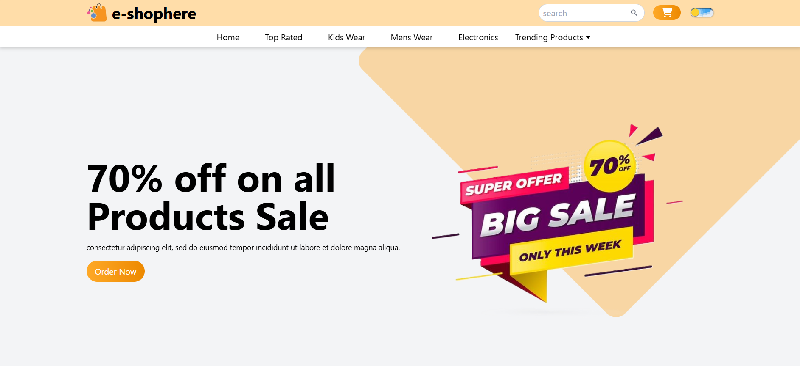

# 🛒 E-Shophere E-commerce Website  
### Built with React.js, Tailwind CSS, Firebase, and Stripe

* [Website](https://e-shophere-e-commerce-website-git-main-aaryas-projects-2c3d636c.vercel.app?_vercel_share=fi2sY1yRhn7Ug1wAhzQHc976atcfJujc)

A modern, responsive, and user-friendly e-commerce platform featuring authentication, product management, cart system, and secure checkout.

---

## 📁 Project Structure

```
E-Shophere-E-commerce-Website/
│── public/
│── src/
│   ├── components/
│   ├── pages/
│   ├── assets/
│   ├── App.jsx
│   ├── main.jsx
│── package.json
│── tailwind.config.js
│── firebase-config.js
│── README.md
```

---

## 🚀 Getting Started

### 1️⃣ Clone the repository
```bash
git clone https://github.com/aaryamahajan919/E-Shophere-E-commerce-website.git
cd E-Shophere-E-commerce-website
```

### 2️⃣ Install dependencies
```bash
npm install
```

### 3️⃣ Set up Firebase
- Go to Firebase Console  
- Enable Authentication, Firestore & Storage  
- Add your Firebase config to `firebase-config.js`

### 4️⃣ Set up Stripe
- Create account at Stripe  
- Add your Stripe keys to `.env`

### 5️⃣ Run development server
```bash
npm run dev
```

### 6️⃣ Build for production
```bash
npm run build
```

---

## 🖼️ Preview



---

## 🧩 Components

| Component | Description |
|----------|-------------|
| Navbar | Responsive header with cart + login |
| Home Page | Featured items & categories |
| Product Page | Product details + add to cart |
| Cart | Real-time cart system |
| Checkout | Stripe secure payments |
| Footer | Clean responsive footer |

---

## 📦 Deployment

### GitHub Pages
```bash
npm run build
git subtree push --prefix dist origin gh-pages
```

### AWS S3 + CloudFront  
1. Build  
2. Upload to S3  
3. Enable static hosting  
4. Connect CloudFront  

---

## 🤝 Contributing
Open issues or pull requests anytime.

---

## ⭐ Support
If you like this project, please ⭐ star the repo!

---

## 📧 Contact
**Aarya Mahajan**  
Software Developer  
GitHub | LinkedIn
